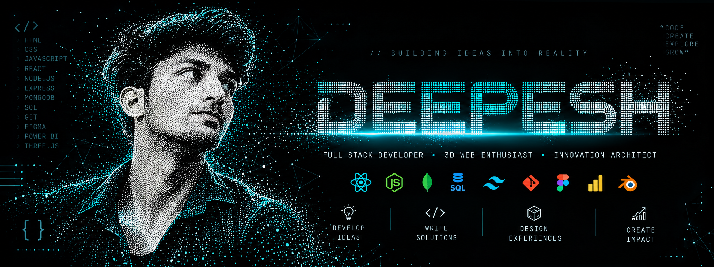

# bunnydiwakar18-commits
<!-- ===================== HERO BANNER ===================== -->

<p align="center">
  
</p>

<h1 align="center">
  ⚡ DEEPESH ⚡
</h1>

<p align="center">
  <b>Full Stack Developer • 3D Web Enthusiast • Innovation Architect</b>
</p>

<p align="center">
  <a href="https://github.com/">
    
  </a>
  
  
  
</p>

---

# 🌌 About Me

I'm **Deepesh**, a developer who enjoys building modern digital experiences
where **technology meets creativity**.

I love transforming ideas into interactive, scalable and visually engaging
applications.

My interests include:

- 🚀 Full Stack Web Development
- 🎨 UI/UX Design
- 🌐 Interactive & 3D Web Experiences
- ⚡ Performance Optimization
- 🧠 Problem Solving
- 🛠️ Building creative digital products

---

# 💻 Tech Stack

### 🎨 Frontend

<p>
  
</p>

### ⚙️ Backend

<p>
  
</p>

### 🗄️ Database

<p>
  
</p>

### 🛠️ Tools

<p>
  
</p>

### 🎨 Design & Creative Tools

<p>
  
</p>

### 📊 Data & Analytics

<p>
  
</p>

---

# 🚀 What I Build

```text
┌──────────────────────────────────────────────────────┐
│                                                      │
│   💡 DEVELOP IDEAS                                   │
│                                                      │
│   Turning concepts into functional applications.     │
│                                                      │
├──────────────────────────────────────────────────────┤
│                                                      │
│   ⚡ WRITE SOLUTIONS                                  │
│                                                      │
│   Building clean and scalable code.                  │
│                                                      │
├──────────────────────────────────────────────────────┤
│                                                      │
│   🎨 DESIGN EXPERIENCES                               │
│                                                      │
│   Creating modern and intuitive interfaces.          │
│                                                      │
├──────────────────────────────────────────────────────┤
│                                                      │
│   🌎 CREATE IMPACT                                   │
│                                                      │
│   Building products that solve real problems.        │
│                                                      │
└──────────────────────────────────────────────────────┘
```

---

# 🔥 Development Philosophy

> **"Innovation is not about complexity —  
> it's about building systems that feel effortless."**

I focus on:

- 🧩 Clean & scalable architecture
- ⚡ Optimized performance
- 🎨 Seamless UI/UX
- 🔄 Reusable components
- 🧹 Maintainable code
- 🚀 Production-ready applications

---

# 🧪 Currently Exploring

```text
Three.js
   ↓
React Three Fiber
   ↓
3D Web Experiences
   ↓
Advanced Animations
   ↓
System Design
   ↓
Scalable Applications
```

I'm currently exploring:

- 🌐 Three.js
- 🎮 React Three Fiber
- 🧠 Advanced JavaScript
- 🏗️ System Design
- ☁️ Cloud Technologies
- ⚡ Real-Time Applications
- 🔥 Advanced React

---

# 📂 Featured Projects

### 🌐 Personal Portfolio

A modern developer portfolio focused on interactive UI,
animations and creative web experiences.

**Tech:** HTML • CSS • JavaScript • React

---

### 🎵 Music Application

A modern music application concept focused on
clean UI and interactive experiences.

**Tech:** React • JavaScript • CSS

---

### 🌦️ Weather Application

Weather application using API integration to display
real-time weather information.

**Tech:** HTML • CSS • JavaScript • API

---

### 🔐 Login & Sign Up UI

Modern authentication interface featuring
responsive design, gradients and interactive UI.

**Tech:** HTML • CSS • JavaScript

---

# 📊 GitHub Stats

<p align="center">
  

  
</p>

---

# 🔥 Contribution Streak

<p align="center">
  
</p>

---

# 🐍 Contribution Snake

<p align="center">
  
</p>

---

# 🧠 My Developer Mindset

```javascript
const deepesh = {
    role: "Full Stack Developer",

    interests: [
        "Web Development",
        "3D Web",
        "UI/UX",
        "Creative Technology"
    ],

    frontend: [
        "HTML",
        "CSS",
        "JavaScript",
        "React",
        "Next.js"
    ],

    backend: [
        "Node.js",
        "Express.js"
    ],

    databases: [
        "MongoDB",
        "MySQL",
        "PostgreSQL"
    ],

    currentlyLearning: [
        "Three.js",
        "React Three Fiber",
        "System Design"
    ],

    mindset: "Build • Learn • Improve • Repeat"
};
```

---

# 🌐 Connect With Me

<p align="center">

<a href="YOUR_LINKEDIN_URL">

</a>

<a href="mailto:YOUR_EMAIL@gmail.com">

</a>

<a href="https://github.com/DEEPESH7701">

</a>

</p>

---

<h3 align="center">

⚡ CODE • CREATE • EXPLORE • GROW ⚡

</h3>

<p align="center">
  <i>Let's build the future of the web.</i>
</p>

<p align="center">
  ─────────────────────────────────────────
</p>

<p align="center">
  <b>Thanks for visiting my profile! 🚀</b>
</p>
